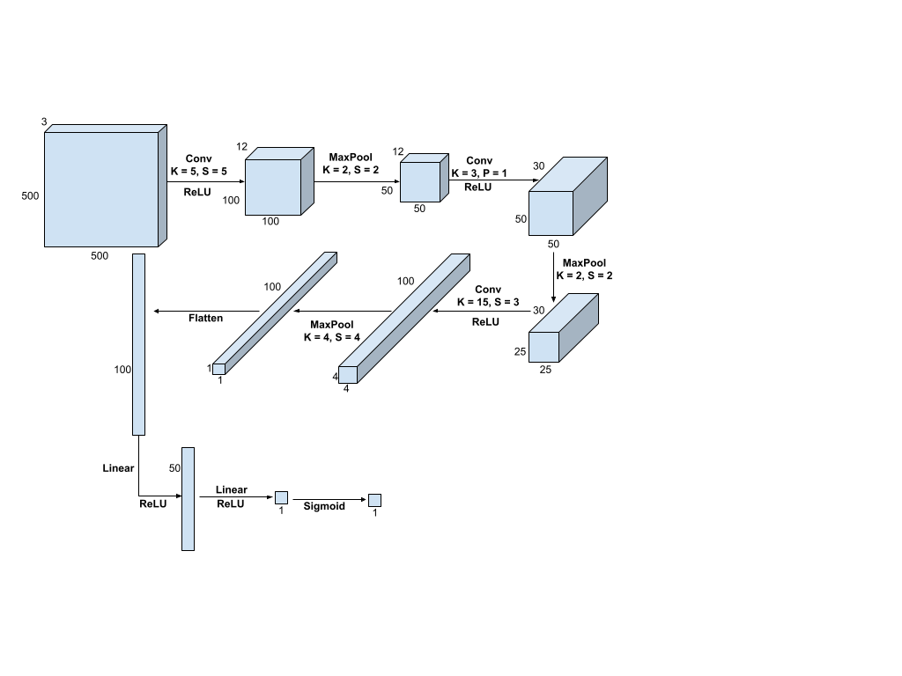
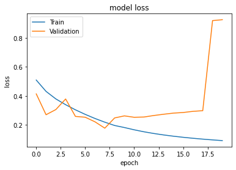
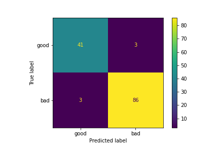
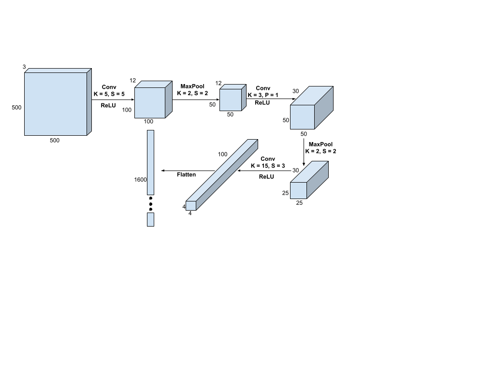
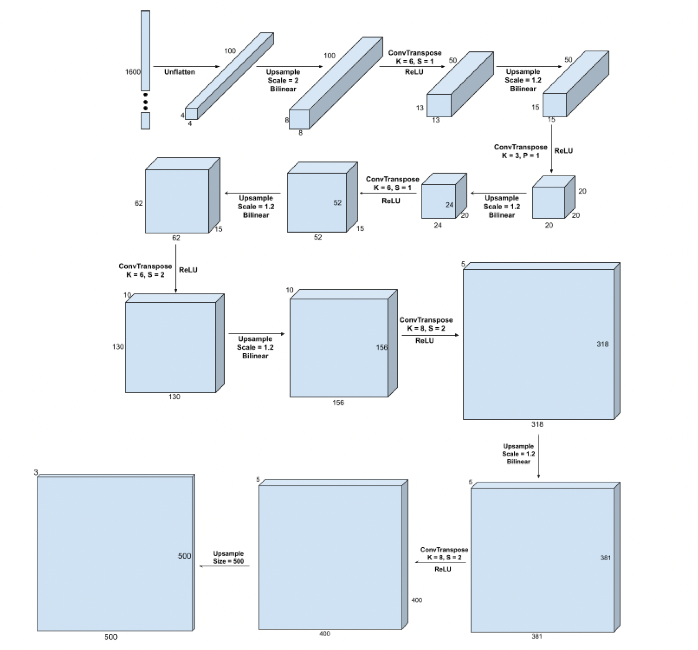
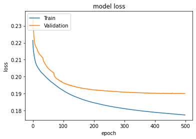
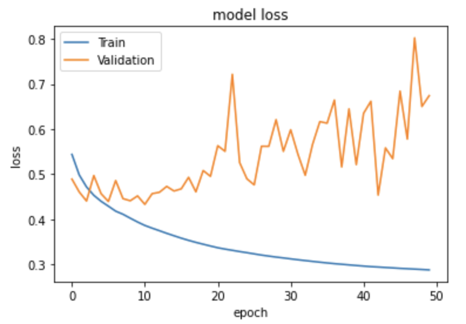
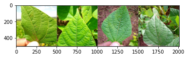
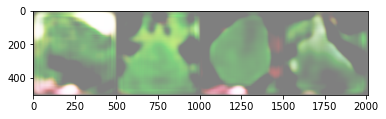
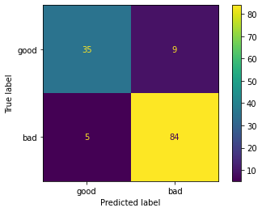

# MSAI437: Deep Learning - Assignment 2

The chaotic repo of Rohin, David, Kushal and Praneet.

In this assignment, we implemented binary image classifiers on a low-resource dataset. We worked with a dataset of approximately 1,300 images of the leaves of healthy and unhealthy bean plants
(the “Beans” dataset, see https://github.com/AI-Lab-Makerere/ibean/blob/master/README.md).

## CNN
### Architecture

### Hyperparameters
- Loss Function: Binary Cross-Entropy
- Optimizer: Adam Optimizer
- Learning Rate: 0.001
- Number of Training Epochs: 20

### Loss Curves

### Validation Set Performance

Validation accuracy: 0.9549

### Limitations
The main limitation of our CNN is that it is unable to represent spatial information about the
features it is extracting. This can cause issues because if certain filters are mainly contributing
to the unhealthy classification and that feature is found in the background of a healthy leaf, the
image will be classified incorrectly. The CNN has no way of saying “This feature should be found
near the center of the image (where the leaf is).”

## Autoencoder
### Methodology
We trained the autoencoder on the Beans dataset using only the healthy leaves. We used the
input images themselves as labels, and minimized the Mean Squared Error. The encoder
condenses the 3x500x500 image into a 1x1600 latent space.
Once the autoencoder was trained, we discarded the decoder half of the architecture (see next
two pages), retaining only the encoder.
We then used a feed forward neural network (FFNN) to classify the Beans dataset. We passed
all the images through the encoder to create a 1x1600 vector. It was then just a simple matter of
running a FFNN on the 1x1600 vector for classification into healthy or unhealthy. We used
Binary Cross Entropy as the loss function.

### Architecture
#### Encoder

#### Feed Forward Neural Network

#### Decoder

### Hyperparameters
#### Autoencoder
- Loss Function: Mean Squared Error
- Optimizer: Adam Optimizer
- Learning Rate: 0.00001
- Number of Training Epochs: 500
#### Feed Forward Neural Network
- Loss Function: Binary Cross-Entropy
- Optimizer: Adam Optimizer
- Learning Rate: 0.0001
- Number of Training Epochs: 100

### Loss Curves
#### Autoencoder

#### Feed Forward Neural Network

### Validation Set Performance
#### Autoencoder Image Reconstruction
##### Ground Truth

##### Reconstruction

#### Feed Forward Neural Network Classification

Validation accuracy = 0.8947

### Limitations
- The autoencoder was trained on just healthy leaf images so there is no guarantee about
a consistent encoding of unhealthy leaves.
- The autoencoder and the feed forward neural network (FFNN) were not being trained
simultaneously towards the same task. The FFNN was trying to classify both healthy and
unhealthy leaves condensed into the latent space by an autoencoder trained only on
healthy leaves. It would have been more efficient to train the autoencoder on both types
of leaves.

## Alternate Approaches and Methods
1. Multiclass classification: We had two different types of diseases in the dataset, but
chose to lump them together. Maybe if we attempt to learn the differences between
them, we can perform better overall.
2. Knowledge-based approach: We can imagine a knowledge base which knows more
about the visual features of each type of disease, and a computer vision algorithm that
attempts to extract these features.
3. Data augmentation: There are several ways to increase the small amount of training
data that we have - we can blur, zoom, rotate, and realign the images to create “new”
data points.
4. Better targeting: We can first try to locate the leaf of interest in the image (by
segmentation / bounding boxes, for example), and then apply classification techniques.
5. Transfer learning: We can try to use a classifier pretrained on some other (similar)
classification task and fine-tune it for our needs.
6. K-Nearest Neighbors: KNN performs well on small data sets, but we will need to
convert the images to a latent representation (such as with the autoencoder above)
before it would make sense to measure “distance” between images.
7. Denoising Autoencoder: We can try to mask portions of the leaf in the input, and train
the autoencoder. This way, it learns a more robust representation of the leaves and is
more resistant to noise.